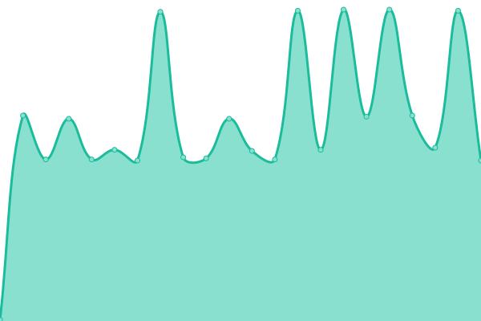
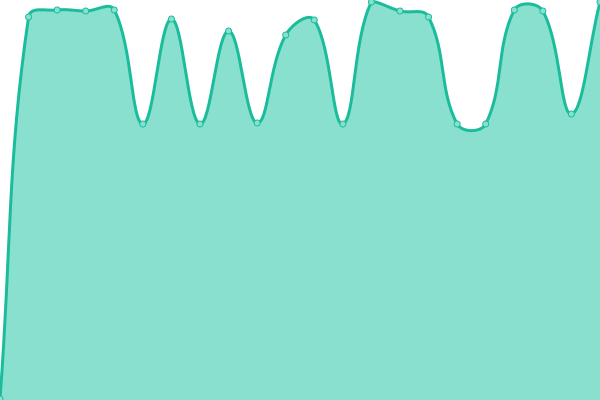
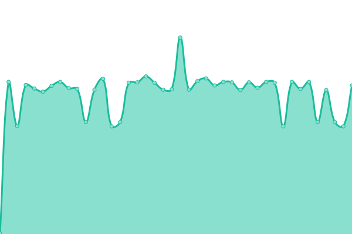
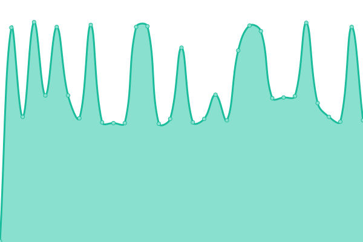
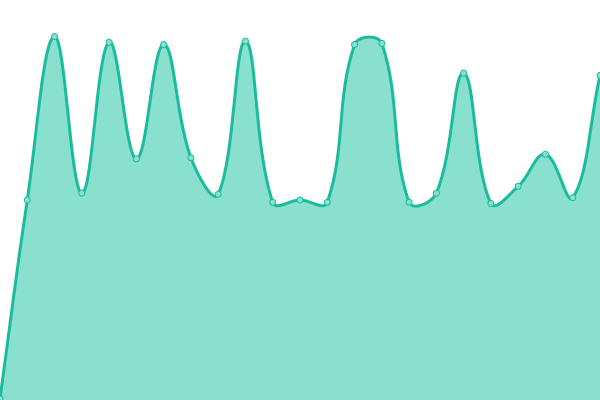
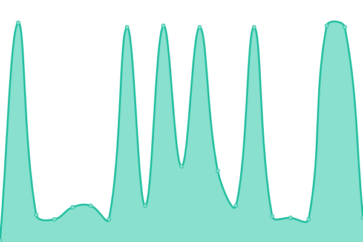
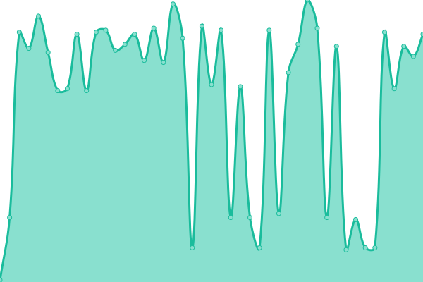
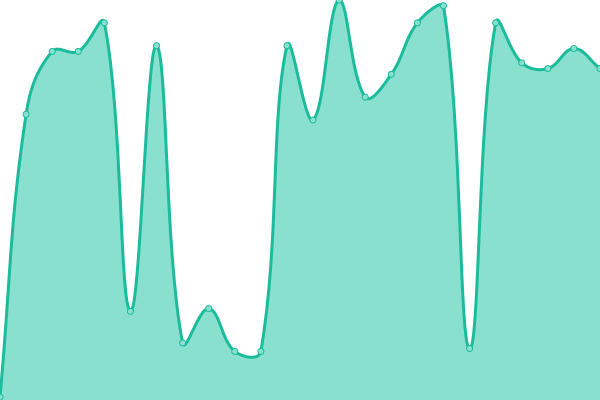
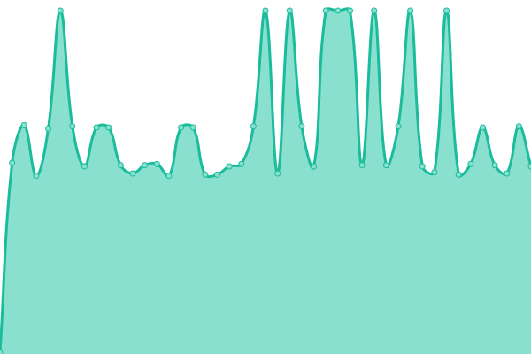
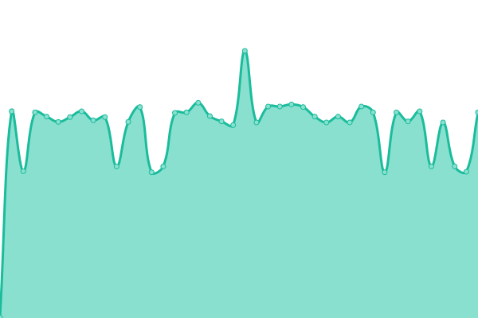

# [📈 Live Status](https://status.tgstation13.org): <!--live status--> **🟩 All systems operational**

This repository contains the open-source uptime monitor and status page for [Upptime](https://upptime.js.org), powered by [Upptime](https://github.com/upptime/upptime).

With [Upptime](https://upptime.js.org), you can get your own unlimited and free uptime monitor and status page, powered entirely by a GitHub repository. We use [Issues](https://github.com/upptime/upptime/issues) as incident reports, [Actions](https://github.com/tgstation-operations/status/actions) as uptime monitors, and [Pages](https://status.tgstation13.org) for the status page.

<!--start: status pages-->
<!-- This summary is generated by Upptime (https://github.com/upptime/upptime) -->
<!-- Do not edit this manually, your changes will be overwritten -->
<!-- prettier-ignore -->
| URL | Status | History | Response Time | Uptime |
| --- | ------ | ------- | ------------- | ------ |
|  [Home Page](https://tgstation13.org) | 🟩 Up | [home-page.yml](https://github.com/tgstation-operations/status/commits/HEAD/history/home-page.yml) | 

 196ms
     
 | 

<a href="https://status.tgstation13.org/history/home-page">100.00%</a>
    

|  [Wiki](https://tgstation13.org/wiki/Ping) | 🟩 Up | [wiki.yml](https://github.com/tgstation-operations/status/commits/HEAD/history/wiki.yml) | 

 350ms
     
 | 

<a href="https://status.tgstation13.org/history/wiki">84.25%</a>
    

|  [Forum](https://tgstation13.org/phpBB/viewtopic.php?p=302039) | 🟩 Up | [forum.yml](https://github.com/tgstation-operations/status/commits/HEAD/history/forum.yml) | 

 452ms
     
 | 

<a href="https://status.tgstation13.org/history/forum">84.26%</a>
    

|  TTS Webserver | 🟩 Up | [tts-webserver.yml](https://github.com/tgstation-operations/status/commits/HEAD/history/tts-webserver.yml) | 

 317ms
     
 | 

<a href="https://status.tgstation13.org/history/tts-webserver">100.00%</a>
    

|  TTS API | 🟩 Up | [tts-api.yml](https://github.com/tgstation-operations/status/commits/HEAD/history/tts-api.yml) | 

 82ms
     
 | 

<a href="https://status.tgstation13.org/history/tts-api">100.00%</a>
    

|  TTS Generation | 🟩 Up | [tts-generation.yml](https://github.com/tgstation-operations/status/commits/HEAD/history/tts-generation.yml) | 

 359ms
     
 | 

<a href="https://status.tgstation13.org/history/tts-generation">100.00%</a>
    

|  [Game Server Sybil](sybil.game.tgstation13.org) | 🟩 Up | [game-server-sybil.yml](https://github.com/tgstation-operations/status/commits/HEAD/history/game-server-sybil.yml) | 

 19ms
     
 | 

<a href="https://status.tgstation13.org/history/game-server-sybil">100.00%</a>
    

|  [Game Server Basil](Basil.game.tgstation13.org) | 🟩 Up | [game-server-basil.yml](https://github.com/tgstation-operations/status/commits/HEAD/history/game-server-basil.yml) | 

 14ms
     
 | 

<a href="https://status.tgstation13.org/history/game-server-basil">100.00%</a>
    

|  [Game Server Terry](Terry.game.tgstation13.org) | 🟩 Up | [game-server-terry.yml](https://github.com/tgstation-operations/status/commits/HEAD/history/game-server-terry.yml) | 

 13ms
     
 | 

<a href="https://status.tgstation13.org/history/game-server-terry">100.00%</a>
    

|  [Game Server Manuel](Manuel.game.tgstation13.org) | 🟩 Up | [game-server-manuel.yml](https://github.com/tgstation-operations/status/commits/HEAD/history/game-server-manuel.yml) | 

 29ms
     
 | 

<a href="https://status.tgstation13.org/history/game-server-manuel">100.00%</a>
    

|  [Game Server TGMC](TGMC.game.tgstation13.org) | 🟩 Up | [game-server-tgmc.yml](https://github.com/tgstation-operations/status/commits/HEAD/history/game-server-tgmc.yml) | 

 14ms
     
 | 

<a href="https://status.tgstation13.org/history/game-server-tgmc">100.00%</a>
    

|  [Game Server Campbell](Campbell.game.tgstation13.org) | 🟩 Up | [game-server-campbell.yml](https://github.com/tgstation-operations/status/commits/HEAD/history/game-server-campbell.yml) | 

 14ms
     
 | 

<a href="https://status.tgstation13.org/history/game-server-campbell">100.00%</a>
    

|  [Game Server Events EU](terry.game.tgstation13.org) | 🟩 Up | [game-server-events-eu.yml](https://github.com/tgstation-operations/status/commits/HEAD/history/game-server-events-eu.yml) | 

 13ms
     
 | 

<a href="https://status.tgstation13.org/history/game-server-events-eu">100.00%</a>
    

|  [Game Server Events US](basil.game.tgstation13.org) | 🟩 Up | [game-server-events-us.yml](https://github.com/tgstation-operations/status/commits/HEAD/history/game-server-events-us.yml) | 

 13ms
     
 | 

<a href="https://status.tgstation13.org/history/game-server-events-us">100.00%</a>
    

|  [DDoS-Relay EU-C-fra1-01](http://165.227.138.121:42069/;csv) | 🟩 Up | [d-do-s-relay-eu-c-fra1-01.yml](https://github.com/tgstation-operations/status/commits/HEAD/history/d-do-s-relay-eu-c-fra1-01.yml) | 

 218ms
     
 | 

<a href="https://status.tgstation13.org/history/d-do-s-relay-eu-c-fra1-01">90.74%</a>
    

|  [DDoS-Relay EU-C-fra1-02](http://46.101.211.76:42069/;csv) | 🟩 Up | [d-do-s-relay-eu-c-fra1-02.yml](https://github.com/tgstation-operations/status/commits/HEAD/history/d-do-s-relay-eu-c-fra1-02.yml) | 

 253ms
     
 | 

<a href="https://status.tgstation13.org/history/d-do-s-relay-eu-c-fra1-02">95.97%</a>
    

|  [DDoS-Relay US-E-nyc1-01](http://178.128.157.126:42069/;csv) | 🟩 Up | [d-do-s-relay-us-e-nyc1-01.yml](https://github.com/tgstation-operations/status/commits/HEAD/history/d-do-s-relay-us-e-nyc1-01.yml) | 

 126ms
     
 | 

<a href="https://status.tgstation13.org/history/d-do-s-relay-us-e-nyc1-01">95.13%</a>
    

|  [DDoS-Relay US-E-nyc1-02](http://178.128.149.244:42069/;csv) | 🟩 Up | [d-do-s-relay-us-e-nyc1-02.yml](https://github.com/tgstation-operations/status/commits/HEAD/history/d-do-s-relay-us-e-nyc1-02.yml) | 

 65ms
     
 | 

<a href="https://status.tgstation13.org/history/d-do-s-relay-us-e-nyc1-02">91.40%</a>
    

|  [DDoS-Relay US-W-sfo3-01](http://144.126.221.210:42069/;csv) | 🟩 Up | [d-do-s-relay-us-w-sfo3-01.yml](https://github.com/tgstation-operations/status/commits/HEAD/history/d-do-s-relay-us-w-sfo3-01.yml) | 

 228ms
     
 | 

<a href="https://status.tgstation13.org/history/d-do-s-relay-us-w-sfo3-01">88.62%</a>
    

|  [DDoS-Relay US-W-sfo3-02](http://144.126.222.59:42069/;csv) | 🟩 Up | [d-do-s-relay-us-w-sfo3-02.yml](https://github.com/tgstation-operations/status/commits/HEAD/history/d-do-s-relay-us-w-sfo3-02.yml) | 

 279ms
     
 | 

<a href="https://status.tgstation13.org/history/d-do-s-relay-us-w-sfo3-02">88.34%</a>
    

|  [DDoS-Relay EU-W-lon1-01](http://165.22.122.245:42069/;csv) | 🟩 Up | [d-do-s-relay-eu-w-lon1-01.yml](https://github.com/tgstation-operations/status/commits/HEAD/history/d-do-s-relay-eu-w-lon1-01.yml) | 

 194ms
     
 | 

<a href="https://status.tgstation13.org/history/d-do-s-relay-eu-w-lon1-01">100.00%</a>
    

|  [DDoS-Relay EU-W-lon1-02](http://165.22.121.127:42069/;csv) | 🟩 Up | [d-do-s-relay-eu-w-lon1-02.yml](https://github.com/tgstation-operations/status/commits/HEAD/history/d-do-s-relay-eu-w-lon1-02.yml) | 

 194ms
     
 | 

<a href="https://status.tgstation13.org/history/d-do-s-relay-eu-w-lon1-02">99.75%</a>
    

|  [DDoS-Relay AU-syd1-01](http://170.64.170.126:42069/;csv) | 🟩 Up | [d-do-s-relay-au-syd1-01.yml](https://github.com/tgstation-operations/status/commits/HEAD/history/d-do-s-relay-au-syd1-01.yml) | 

 354ms
     
 | 

<a href="https://status.tgstation13.org/history/d-do-s-relay-au-syd1-01">99.74%</a>
    

|  [DDoS-Relay AU-syd1-02](http://170.64.168.113:42069/;csv) | 🟩 Up | [d-do-s-relay-au-syd1-02.yml](https://github.com/tgstation-operations/status/commits/HEAD/history/d-do-s-relay-au-syd1-02.yml) | 

 359ms
     
 | 

<a href="https://status.tgstation13.org/history/d-do-s-relay-au-syd1-02">100.00%</a>
    

|  [DDoS-Relay lin-EU-C-fra-01](http://139.162.181.177:42069/;csv) | 🟩 Up | [d-do-s-relay-lin-eu-c-fra-01.yml](https://github.com/tgstation-operations/status/commits/HEAD/history/d-do-s-relay-lin-eu-c-fra-01.yml) | 

 225ms
     
 | 

<a href="https://status.tgstation13.org/history/d-do-s-relay-lin-eu-c-fra-01">98.97%</a>
    

|  [DDoS-Relay lin-EU-C-fra-02](http://172.104.128.38:42069/;csv) | 🟩 Up | [d-do-s-relay-lin-eu-c-fra-02.yml](https://github.com/tgstation-operations/status/commits/HEAD/history/d-do-s-relay-lin-eu-c-fra-02.yml) | 

 230ms
     
 | 

<a href="https://status.tgstation13.org/history/d-do-s-relay-lin-eu-c-fra-02">99.79%</a>
    

|  [DDoS-Relay lin-US-E-nj-01](http://97.107.140.73:42069/;csv) | 🟩 Up | [d-do-s-relay-lin-us-e-nj-01.yml](https://github.com/tgstation-operations/status/commits/HEAD/history/d-do-s-relay-lin-us-e-nj-01.yml) | 

 67ms
     
 | 

<a href="https://status.tgstation13.org/history/d-do-s-relay-lin-us-e-nj-01">100.00%</a>
    

|  [DDoS-Relay lin-US-E-nj-02](http://97.107.140.132:42069/;csv) | 🟩 Up | [d-do-s-relay-lin-us-e-nj-02.yml](https://github.com/tgstation-operations/status/commits/HEAD/history/d-do-s-relay-lin-us-e-nj-02.yml) | 

 66ms
     
 | 

<a href="https://status.tgstation13.org/history/d-do-s-relay-lin-us-e-nj-02">100.00%</a>
    

|  [DDoS-Relay lin-US-W-lax-01](http://172.233.157.179:42069/;csv) | 🟩 Up | [d-do-s-relay-lin-us-w-lax-01.yml](https://github.com/tgstation-operations/status/commits/HEAD/history/d-do-s-relay-lin-us-w-lax-01.yml) | 

 81ms
     
 | 

<a href="https://status.tgstation13.org/history/d-do-s-relay-lin-us-w-lax-01">99.39%</a>
    

|  [DDoS-Relay lin-US-W-lax-02](http://172.233.152.17:42069/;csv) | 🟩 Up | [d-do-s-relay-lin-us-w-lax-02.yml](https://github.com/tgstation-operations/status/commits/HEAD/history/d-do-s-relay-lin-us-w-lax-02.yml) | 

 82ms
     
 | 

<a href="https://status.tgstation13.org/history/d-do-s-relay-lin-us-w-lax-02">99.39%</a>
    

|  [DDoS-Relay lin-EU-W-lon2-01](http://172.236.29.5:42069/;csv) | 🟩 Up | [d-do-s-relay-lin-eu-w-lon2-01.yml](https://github.com/tgstation-operations/status/commits/HEAD/history/d-do-s-relay-lin-eu-w-lon2-01.yml) | 

 209ms
     
 | 

<a href="https://status.tgstation13.org/history/d-do-s-relay-lin-eu-w-lon2-01">100.00%</a>
    

|  [DDoS-Relay lin-AU-syd1-01](http://194.195.251.189:42069/;csv) | 🟩 Up | [d-do-s-relay-lin-au-syd1-01.yml](https://github.com/tgstation-operations/status/commits/HEAD/history/d-do-s-relay-lin-au-syd1-01.yml) | 

 345ms
     
 | 

<a href="https://status.tgstation13.org/history/d-do-s-relay-lin-au-syd1-01">99.39%</a>
    

<!--end: status pages-->

[**Visit our status website →**](https://status.tgstation13.org)

## 📄 License

- Powered by: [Upptime](https://github.com/upptime/upptime)
- Code: [MIT](./LICENSE) © [Anand Chowdhary](https://anandchowdhary.com), supported by [Pabio](https://pabio.com)
- Data in the `./history` directory: [Open Database License](https://opendatacommons.org/licenses/odbl/1-0/)
