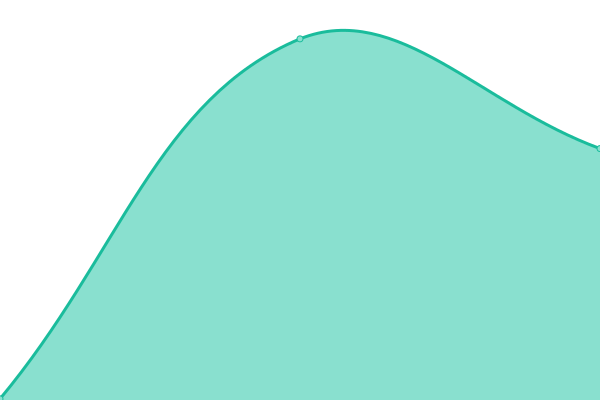
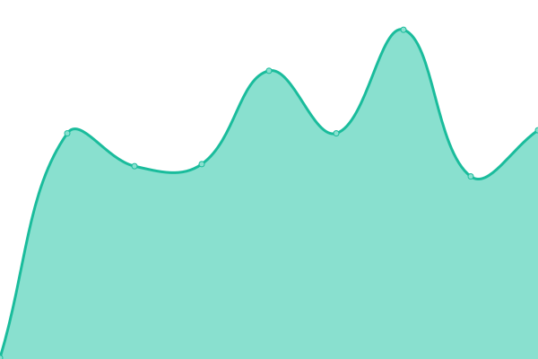
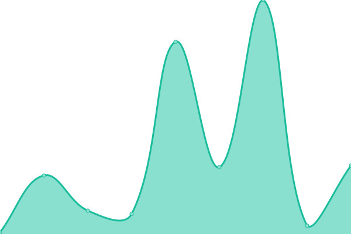
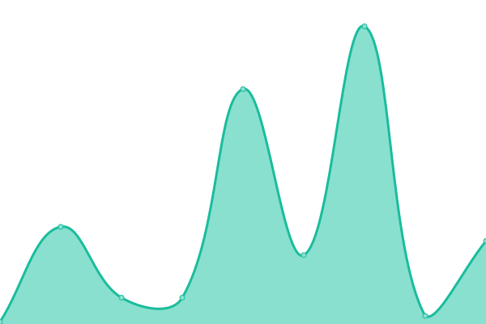
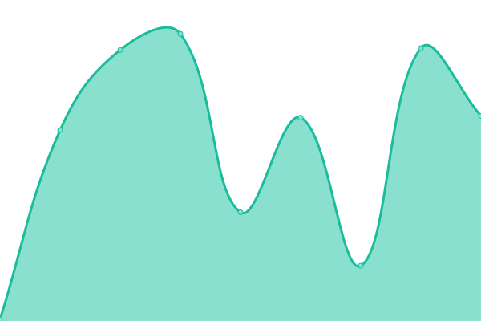

# [📈 Live Status](https://status.tgstation13.org): <!--live status--> **🟧 Partial outage**

This repository contains the open-source uptime monitor and status page for [Upptime](https://upptime.js.org), powered by [Upptime](https://github.com/upptime/upptime).

With [Upptime](https://upptime.js.org), you can get your own unlimited and free uptime monitor and status page, powered entirely by a GitHub repository. We use [Issues](https://github.com/upptime/upptime/issues) as incident reports, [Actions](https://github.com/upptime/upptime/actions) as uptime monitors, and [Pages](https://status.tgstation13.org) for the status page.

<!--start: status pages-->
<!-- This summary is generated by Upptime (https://github.com/upptime/upptime) -->
<!-- Do not edit this manually, your changes will be overwritten -->
<!-- prettier-ignore -->
| URL | Status | History | Response Time | Uptime |
| --- | ------ | ------- | ------------- | ------ |
|  [Home Page](https://tgstation13.org) | 🟥 Down | [home-page.yml](https://github.com/tgstation-operations/status/commits/HEAD/history/home-page.yml) | 

 169ms
     
 | 

<a href="https://status.tgstation13.org/history/home-page">0.00%</a>
    

|  [Wiki](https://tgstation13.org/wiki/Ping) | 🟥 Down | [wiki.yml](https://github.com/tgstation-operations/status/commits/HEAD/history/wiki.yml) | 

 9ms
     
 | 

<a href="https://status.tgstation13.org/history/wiki">0.00%</a>
    

|  [Forum](https://tgstation13.org/phpBB/viewtopic.php?p=302039) | 🟥 Down | [forum.yml](https://github.com/tgstation-operations/status/commits/HEAD/history/forum.yml) | 

 11ms
     
 | 

<a href="https://status.tgstation13.org/history/forum">0.31%</a>
    

|  VPN | 🟥 Down | [vpn.yml](https://github.com/tgstation-operations/status/commits/HEAD/history/vpn.yml) | 

 0ms
     
 | 

<a href="https://status.tgstation13.org/history/vpn">49.56%</a>
    

|  TTS Webserver | 🟩 Up | [tts-webserver.yml](https://github.com/tgstation-operations/status/commits/HEAD/history/tts-webserver.yml) | 

 222ms
     
 | 

<a href="https://status.tgstation13.org/history/tts-webserver">100.00%</a>
    

|  TTS API | 🟩 Up | [tts-api.yml](https://github.com/tgstation-operations/status/commits/HEAD/history/tts-api.yml) | 

 49ms
     
 | 

<a href="https://status.tgstation13.org/history/tts-api">100.00%</a>
    

|  TTS Generation | 🟥 Down | [tts-generation.yml](https://github.com/tgstation-operations/status/commits/HEAD/history/tts-generation.yml) | 

 79ms
     
 | 

<a href="https://status.tgstation13.org/history/tts-generation">1.55%</a>
    

|  [Game Server Sybil](sybil.game.tgstation13.org) | 🟩 Up | [game-server-sybil.yml](https://github.com/tgstation-operations/status/commits/HEAD/history/game-server-sybil.yml) | 

 57ms
     
 | 

<a href="https://status.tgstation13.org/history/game-server-sybil">100.00%</a>
    

|  [Game Server Basil](Basil.game.tgstation13.org) | 🟩 Up | [game-server-basil.yml](https://github.com/tgstation-operations/status/commits/HEAD/history/game-server-basil.yml) | 

 59ms
     
 | 

<a href="https://status.tgstation13.org/history/game-server-basil">100.00%</a>
    

|  [Game Server Terry](Terry.game.tgstation13.org) | 🟩 Up | [game-server-terry.yml](https://github.com/tgstation-operations/status/commits/HEAD/history/game-server-terry.yml) | 

 60ms
     
 | 

<a href="https://status.tgstation13.org/history/game-server-terry">100.00%</a>
    

|  [Game Server Manuel](Manuel.game.tgstation13.org) | 🟩 Up | [game-server-manuel.yml](https://github.com/tgstation-operations/status/commits/HEAD/history/game-server-manuel.yml) | 

 57ms
     
 | 

<a href="https://status.tgstation13.org/history/game-server-manuel">100.00%</a>
    

|  [Game Server TGMC](TGMC.game.tgstation13.org) | 🟩 Up | [game-server-tgmc.yml](https://github.com/tgstation-operations/status/commits/HEAD/history/game-server-tgmc.yml) | 

 58ms
     
 | 

<a href="https://status.tgstation13.org/history/game-server-tgmc">100.00%</a>
    

|  [Game Server Campbell](Campbell.game.tgstation13.org) | 🟩 Up | [game-server-campbell.yml](https://github.com/tgstation-operations/status/commits/HEAD/history/game-server-campbell.yml) | 

 56ms
     
 | 

<a href="https://status.tgstation13.org/history/game-server-campbell">100.00%</a>
    

|  [Game Server Events EU](terry.game.tgstation13.org) | 🟩 Up | [game-server-events-eu.yml](https://github.com/tgstation-operations/status/commits/HEAD/history/game-server-events-eu.yml) | 

 57ms
     
 | 

<a href="https://status.tgstation13.org/history/game-server-events-eu">100.00%</a>
    

|  [Game Server Events US](basil.game.tgstation13.org) | 🟩 Up | [game-server-events-us.yml](https://github.com/tgstation-operations/status/commits/HEAD/history/game-server-events-us.yml) | 

 58ms
     
 | 

<a href="https://status.tgstation13.org/history/game-server-events-us">100.00%</a>
    

|  [DDoS-Relay EU-C-1-1](http://78.46.253.198:42069/;csv) | 🟨 Degraded | [d-do-s-relay-eu-c-1-1.yml](https://github.com/tgstation-operations/status/commits/HEAD/history/d-do-s-relay-eu-c-1-1.yml) | 

 0ms
     
 | 

<a href="https://status.tgstation13.org/history/d-do-s-relay-eu-c-1-1">2.44%</a>
    

|  [DDoS-Relay EU-C-1-2](http://167.235.254.130:42069/;csv) | 🟨 Degraded | [d-do-s-relay-eu-c-1-2.yml](https://github.com/tgstation-operations/status/commits/HEAD/history/d-do-s-relay-eu-c-1-2.yml) | 

 0ms
     
 | 

<a href="https://status.tgstation13.org/history/d-do-s-relay-eu-c-1-2">1.91%</a>
    

|  [DDoS-Relay EU-C-1-3](http://49.13.124.167:42069/;csv) | 🟨 Degraded | [d-do-s-relay-eu-c-1-3.yml](https://github.com/tgstation-operations/status/commits/HEAD/history/d-do-s-relay-eu-c-1-3.yml) | 

 0ms
     
 | 

<a href="https://status.tgstation13.org/history/d-do-s-relay-eu-c-1-3">5.63%</a>
    

|  [DDoS-Relay EU-C-1-4](http://188.245.50.246:42069/;csv) | 🟨 Degraded | [d-do-s-relay-eu-c-1-4.yml](https://github.com/tgstation-operations/status/commits/HEAD/history/d-do-s-relay-eu-c-1-4.yml) | 

 0ms
     
 | 

<a href="https://status.tgstation13.org/history/d-do-s-relay-eu-c-1-4">21.70%</a>
    

|  [DDoS-Relay EU-C-2-1](http://128.140.75.62:42069/;csv) | 🟩 Up | [d-do-s-relay-eu-c-2-1.yml](https://github.com/tgstation-operations/status/commits/HEAD/history/d-do-s-relay-eu-c-2-1.yml) | 

 220ms
     
 | 

<a href="https://status.tgstation13.org/history/d-do-s-relay-eu-c-2-1">100.00%</a>
    

|  [DDoS-Relay EU-C-2-2](http://128.140.77.59:42069/;csv) | 🟨 Degraded | [d-do-s-relay-eu-c-2-2.yml](https://github.com/tgstation-operations/status/commits/HEAD/history/d-do-s-relay-eu-c-2-2.yml) | 

 0ms
     
 | 

<a href="https://status.tgstation13.org/history/d-do-s-relay-eu-c-2-2">9.75%</a>
    

|  [DDoS-Relay EU-C-2-3](http://188.245.105.186:42069/;csv) | 🟩 Up | [d-do-s-relay-eu-c-2-3.yml](https://github.com/tgstation-operations/status/commits/HEAD/history/d-do-s-relay-eu-c-2-3.yml) | 

 220ms
     
 | 

<a href="https://status.tgstation13.org/history/d-do-s-relay-eu-c-2-3">100.00%</a>
    

|  [DDoS-Relay EU-N-1](http://37.27.84.228:42069/;csv) | 🟩 Up | [d-do-s-relay-eu-n-1.yml](https://github.com/tgstation-operations/status/commits/HEAD/history/d-do-s-relay-eu-n-1.yml) | 

 257ms
     
 | 

<a href="https://status.tgstation13.org/history/d-do-s-relay-eu-n-1">100.00%</a>
    

|  [DDoS-Relay US-E-1](http://5.161.250.73:42069/;csv) | 🟩 Up | [d-do-s-relay-us-e-1.yml](https://github.com/tgstation-operations/status/commits/HEAD/history/d-do-s-relay-us-e-1.yml) | 

 35ms
     
 | 

<a href="https://status.tgstation13.org/history/d-do-s-relay-us-e-1">100.00%</a>
    

|  [DDoS-Relay US-E-2](http://5.161.186.237:42069/;csv) | 🟩 Up | [d-do-s-relay-us-e-2.yml](https://github.com/tgstation-operations/status/commits/HEAD/history/d-do-s-relay-us-e-2.yml) | 

 48ms
     
 | 

<a href="https://status.tgstation13.org/history/d-do-s-relay-us-e-2">100.00%</a>
    

|  [DDoS-Relay US-W-1](http://5.78.91.168:42069/;csv) | 🟩 Up | [d-do-s-relay-us-w-1.yml](https://github.com/tgstation-operations/status/commits/HEAD/history/d-do-s-relay-us-w-1.yml) | 

 106ms
     
 | 

<a href="https://status.tgstation13.org/history/d-do-s-relay-us-w-1">100.00%</a>
    

|  [DDoS-Relay US-W-2](http://5.78.111.66:42069/;csv) | 🟩 Up | [d-do-s-relay-us-w-2.yml](https://github.com/tgstation-operations/status/commits/HEAD/history/d-do-s-relay-us-w-2.yml) | 

 107ms
     
 | 

<a href="https://status.tgstation13.org/history/d-do-s-relay-us-w-2">100.00%</a>
    

<!--end: status pages-->

[**Visit our status website →**](https://status.tgstation13.org)

## 📄 License

- Powered by: [Upptime](https://github.com/upptime/upptime)
- Code: [MIT](./LICENSE) © [Anand Chowdhary](https://anandchowdhary.com), supported by [Pabio](https://pabio.com)
- Data in the `./history` directory: [Open Database License](https://opendatacommons.org/licenses/odbl/1-0/)
