# [📈 Live Status](https://status.tgstation13.org): <!--live status--> **🟧 Partial outage**

This repository contains the open-source uptime monitor and status page for [Upptime](https://upptime.js.org), powered by [Upptime](https://github.com/upptime/upptime).

With [Upptime](https://upptime.js.org), you can get your own unlimited and free uptime monitor and status page, powered entirely by a GitHub repository. We use [Issues](https://github.com/upptime/upptime/issues) as incident reports, [Actions](https://github.com/tgstation-operations/status/actions) as uptime monitors, and [Pages](https://status.tgstation13.org) for the status page.

<!--start: status pages-->
<!-- This summary is generated by Upptime (https://github.com/upptime/upptime) -->
<!-- Do not edit this manually, your changes will be overwritten -->
<!-- prettier-ignore -->
| URL | Status | History | Response Time | Uptime |
| --- | ------ | ------- | ------------- | ------ |
|  [Home Page](https://tgstation13.org) | 🟩 Up | [home-page.yml](https://github.com/tgstation-operations/status/commits/HEAD/history/home-page.yml) | 

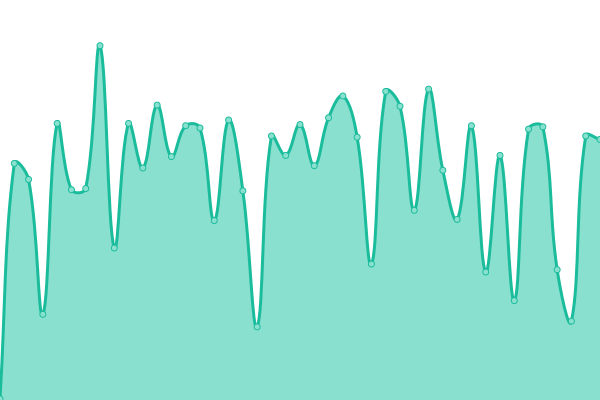 186ms
     
 | 

<a href="https://status.tgstation13.org/history/home-page">92.96%</a>
    

|  [Wiki](https://tgstation13.org/wiki/Ping) | 🟩 Up | [wiki.yml](https://github.com/tgstation-operations/status/commits/HEAD/history/wiki.yml) | 

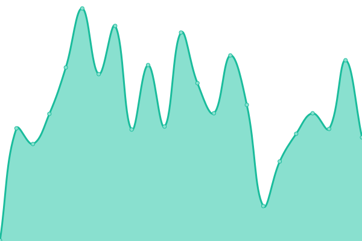 176ms
     
 | 

<a href="https://status.tgstation13.org/history/wiki">92.37%</a>
    

|  [Forum](https://tgstation13.org/phpBB/viewtopic.php?p=302039) | 🟩 Up | [forum.yml](https://github.com/tgstation-operations/status/commits/HEAD/history/forum.yml) | 

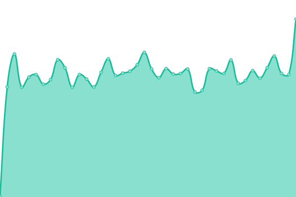 81ms
     
 | 

<a href="https://status.tgstation13.org/history/forum">91.43%</a>
    

|  VPN | 🟩 Up | [vpn.yml](https://github.com/tgstation-operations/status/commits/HEAD/history/vpn.yml) | 

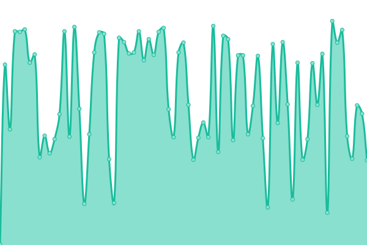 315ms
     
 | 

<a href="https://status.tgstation13.org/history/vpn">92.39%</a>
    

|  TTS Webserver | 🟩 Up | [tts-webserver.yml](https://github.com/tgstation-operations/status/commits/HEAD/history/tts-webserver.yml) | 

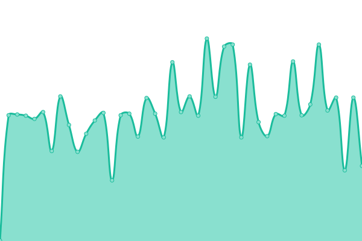 295ms
     
 | 

<a href="https://status.tgstation13.org/history/tts-webserver">100.00%</a>
    

|  TTS API | 🟩 Up | [tts-api.yml](https://github.com/tgstation-operations/status/commits/HEAD/history/tts-api.yml) | 

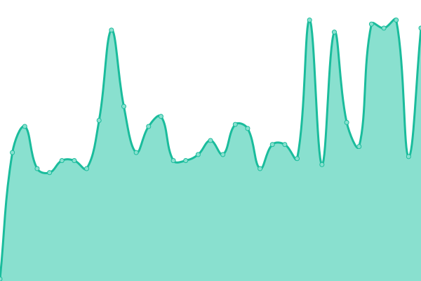 73ms
     
 | 

<a href="https://status.tgstation13.org/history/tts-api">100.00%</a>
    

|  TTS Generation | 🟩 Up | [tts-generation.yml](https://github.com/tgstation-operations/status/commits/HEAD/history/tts-generation.yml) | 

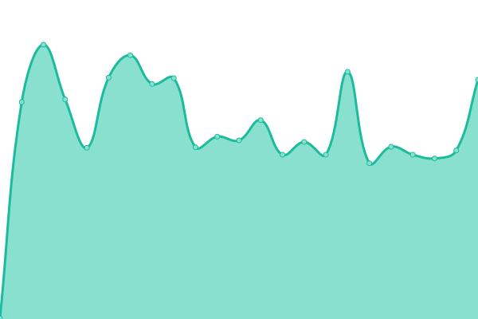 285ms
     
 | 

<a href="https://status.tgstation13.org/history/tts-generation">98.38%</a>
    

|  [Game Server Sybil](sybil.game.tgstation13.org) | 🟩 Up | [game-server-sybil.yml](https://github.com/tgstation-operations/status/commits/HEAD/history/game-server-sybil.yml) | 

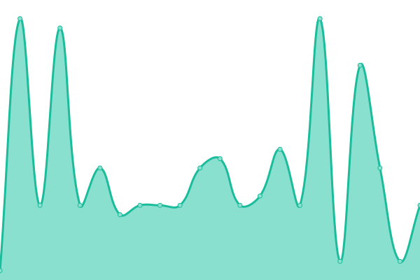 78ms
     
 | 

<a href="https://status.tgstation13.org/history/game-server-sybil">100.00%</a>
    

|  [Game Server Basil](Basil.game.tgstation13.org) | 🟩 Up | [game-server-basil.yml](https://github.com/tgstation-operations/status/commits/HEAD/history/game-server-basil.yml) | 

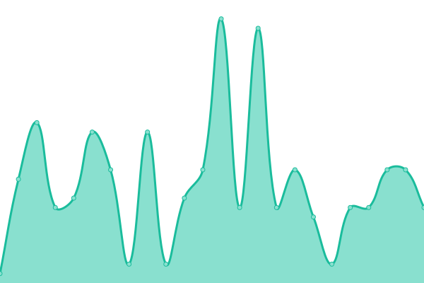 46ms
     
 | 

<a href="https://status.tgstation13.org/history/game-server-basil">100.00%</a>
    

|  [Game Server Terry](Terry.game.tgstation13.org) | 🟩 Up | [game-server-terry.yml](https://github.com/tgstation-operations/status/commits/HEAD/history/game-server-terry.yml) | 

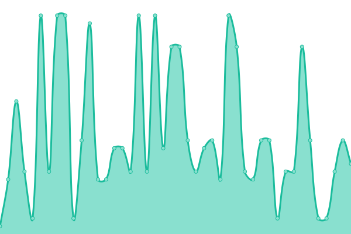 46ms
     
 | 

<a href="https://status.tgstation13.org/history/game-server-terry">100.00%</a>
    

|  [Game Server Manuel](Manuel.game.tgstation13.org) | 🟩 Up | [game-server-manuel.yml](https://github.com/tgstation-operations/status/commits/HEAD/history/game-server-manuel.yml) | 

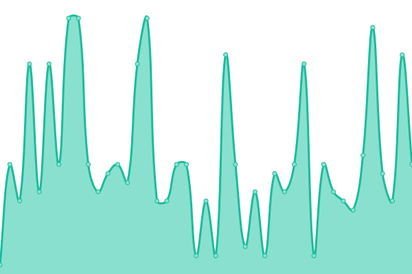 48ms
     
 | 

<a href="https://status.tgstation13.org/history/game-server-manuel">100.00%</a>
    

|  [Game Server TGMC](TGMC.game.tgstation13.org) | 🟩 Up | [game-server-tgmc.yml](https://github.com/tgstation-operations/status/commits/HEAD/history/game-server-tgmc.yml) | 

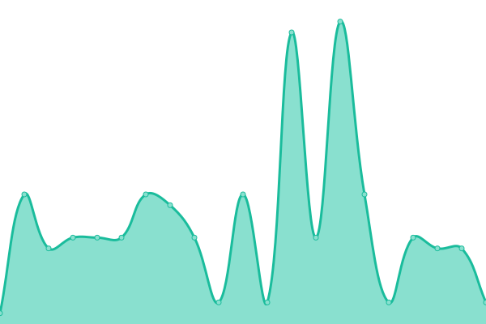 46ms
     
 | 

<a href="https://status.tgstation13.org/history/game-server-tgmc">100.00%</a>
    

|  [Game Server Campbell](Campbell.game.tgstation13.org) | 🟩 Up | [game-server-campbell.yml](https://github.com/tgstation-operations/status/commits/HEAD/history/game-server-campbell.yml) | 

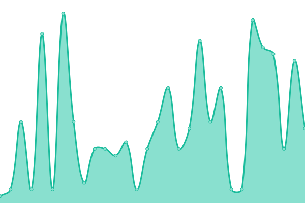 46ms
     
 | 

<a href="https://status.tgstation13.org/history/game-server-campbell">100.00%</a>
    

|  [Game Server Events EU](terry.game.tgstation13.org) | 🟩 Up | [game-server-events-eu.yml](https://github.com/tgstation-operations/status/commits/HEAD/history/game-server-events-eu.yml) | 

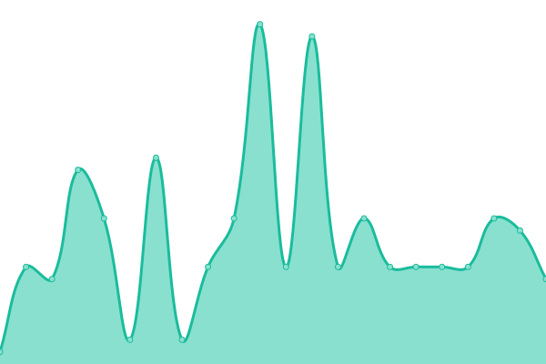 45ms
     
 | 

<a href="https://status.tgstation13.org/history/game-server-events-eu">100.00%</a>
    

|  [Game Server Events US](basil.game.tgstation13.org) | 🟩 Up | [game-server-events-us.yml](https://github.com/tgstation-operations/status/commits/HEAD/history/game-server-events-us.yml) | 

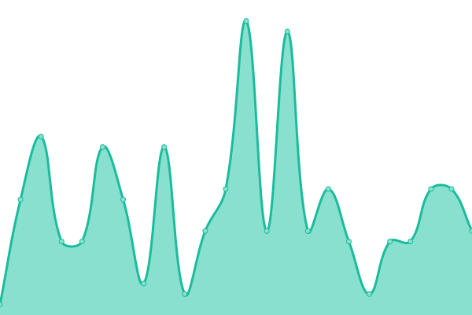 45ms
     
 | 

<a href="https://status.tgstation13.org/history/game-server-events-us">100.00%</a>
    

|  [DDoS-Relay EU-C-fsn1-1](http://162.55.41.97:42069/;csv) | 🟩 Up | [d-do-s-relay-eu-c-fsn1-1.yml](https://github.com/tgstation-operations/status/commits/HEAD/history/d-do-s-relay-eu-c-fsn1-1.yml) | 

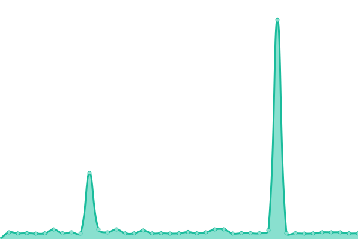 390ms
     
 | 

<a href="https://status.tgstation13.org/history/d-do-s-relay-eu-c-fsn1-1">79.63%</a>
    

|  [DDoS-Relay EU-C-fsn1-2](http://188.245.51.2:42069/;csv) | 🟥 Down | [d-do-s-relay-eu-c-fsn1-2.yml](https://github.com/tgstation-operations/status/commits/HEAD/history/d-do-s-relay-eu-c-fsn1-2.yml) | 

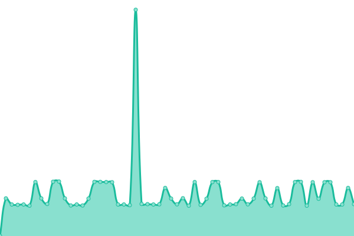 252ms
     
 | 

<a href="https://status.tgstation13.org/history/d-do-s-relay-eu-c-fsn1-2">77.84%</a>
    

|  [DDoS-Relay EU-C-fsn1-3](http://188.245.48.186:42069/;csv) | 🟩 Up | [d-do-s-relay-eu-c-fsn1-3.yml](https://github.com/tgstation-operations/status/commits/HEAD/history/d-do-s-relay-eu-c-fsn1-3.yml) | 

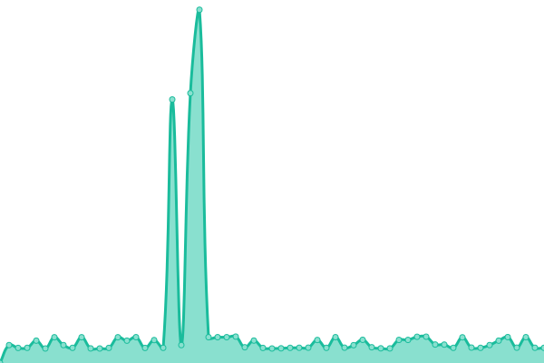 426ms
     
 | 

<a href="https://status.tgstation13.org/history/d-do-s-relay-eu-c-fsn1-3">80.93%</a>
    

|  [DDoS-Relay EU-C-fsn1-4](http://142.132.232.192:42069/;csv) | 🟥 Down | [d-do-s-relay-eu-c-fsn1-4.yml](https://github.com/tgstation-operations/status/commits/HEAD/history/d-do-s-relay-eu-c-fsn1-4.yml) | 

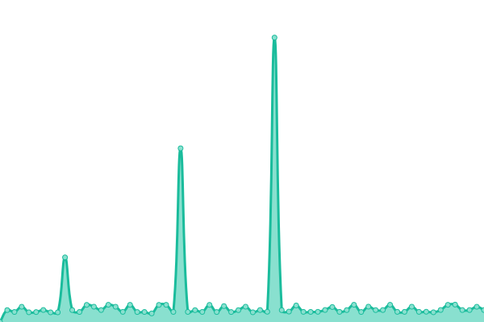 425ms
     
 | 

<a href="https://status.tgstation13.org/history/d-do-s-relay-eu-c-fsn1-4">71.25%</a>
    

|  [DDoS-Relay EU-C-nbg1-2](http://128.140.75.62:42069/;csv) | 🟩 Up | [d-do-s-relay-eu-c-nbg1-2.yml](https://github.com/tgstation-operations/status/commits/HEAD/history/d-do-s-relay-eu-c-nbg1-2.yml) | 

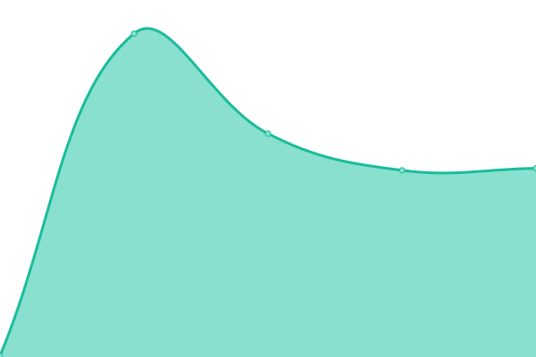 223ms
     
 | 

<a href="https://status.tgstation13.org/history/d-do-s-relay-eu-c-nbg1-2">98.10%</a>
    

|  [DDoS-Relay EU-C-nbg1-4](http://128.140.77.59:42069/;csv) | 🟩 Up | [d-do-s-relay-eu-c-nbg1-4.yml](https://github.com/tgstation-operations/status/commits/HEAD/history/d-do-s-relay-eu-c-nbg1-4.yml) | 

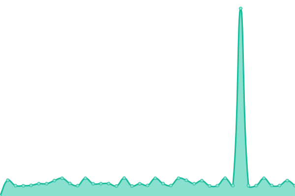 235ms
     
 | 

<a href="https://status.tgstation13.org/history/d-do-s-relay-eu-c-nbg1-4">72.88%</a>
    

|  [DDoS-Relay EU-C-nbg1-6](http://188.245.105.186:42069/;csv) | 🟩 Up | [d-do-s-relay-eu-c-nbg1-6.yml](https://github.com/tgstation-operations/status/commits/HEAD/history/d-do-s-relay-eu-c-nbg1-6.yml) | 

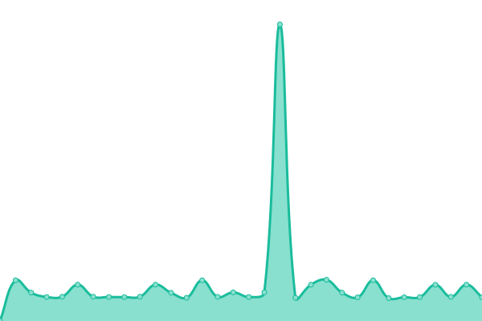 330ms
     
 | 

<a href="https://status.tgstation13.org/history/d-do-s-relay-eu-c-nbg1-6">97.47%</a>
    

|  [DDoS-Relay US-E-ash-1](http://5.161.250.73:42069/;csv) | 🟨 Degraded | [d-do-s-relay-us-e-ash-1.yml](https://github.com/tgstation-operations/status/commits/HEAD/history/d-do-s-relay-us-e-ash-1.yml) | 

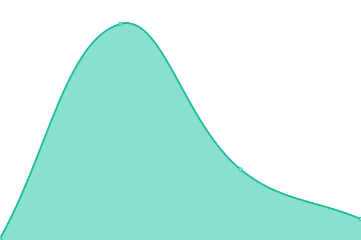 176ms
     
 | 

<a href="https://status.tgstation13.org/history/d-do-s-relay-us-e-ash-1">92.08%</a>
    

|  [DDoS-Relay US-E-ash-2](http://5.161.186.237:42069/;csv) | 🟥 Down | [d-do-s-relay-us-e-ash-2.yml](https://github.com/tgstation-operations/status/commits/HEAD/history/d-do-s-relay-us-e-ash-2.yml) | 

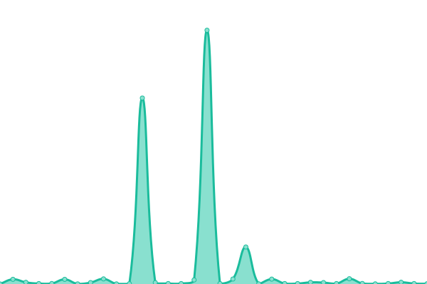 265ms
     
 | 

<a href="https://status.tgstation13.org/history/d-do-s-relay-us-e-ash-2">72.33%</a>
    

|  [DDoS-Relay US-E-ash-4](http://5.161.201.13:42069/;csv) | 🟩 Up | [d-do-s-relay-us-e-ash-4.yml](https://github.com/tgstation-operations/status/commits/HEAD/history/d-do-s-relay-us-e-ash-4.yml) | 

 29ms
     
 | 

<a href="https://status.tgstation13.org/history/d-do-s-relay-us-e-ash-4">91.14%</a>
    

|  [DDoS-Relay US-W-hil-1](http://5.78.91.168:42069/;csv) | 🟩 Up | [d-do-s-relay-us-w-hil-1.yml](https://github.com/tgstation-operations/status/commits/HEAD/history/d-do-s-relay-us-w-hil-1.yml) | 

 114ms
     
 | 

<a href="https://status.tgstation13.org/history/d-do-s-relay-us-w-hil-1">87.11%</a>
    

|  [DDoS-Relay US-W-hil-2](http://5.78.111.66:42069/;csv) | 🟥 Down | [d-do-s-relay-us-w-hil-2.yml](https://github.com/tgstation-operations/status/commits/HEAD/history/d-do-s-relay-us-w-hil-2.yml) | 

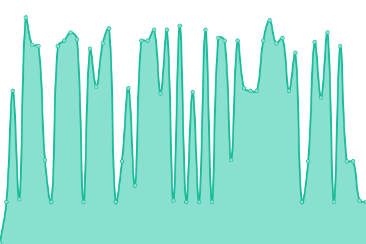 102ms
     
 | 

<a href="https://status.tgstation13.org/history/d-do-s-relay-us-w-hil-2">68.68%</a>
    

|  [DDoS-Relay US-W-hil-3](http://5.78.64.252:42069/;csv) | 🟥 Down | [d-do-s-relay-us-w-hil-3.yml](https://github.com/tgstation-operations/status/commits/HEAD/history/d-do-s-relay-us-w-hil-3.yml) | 

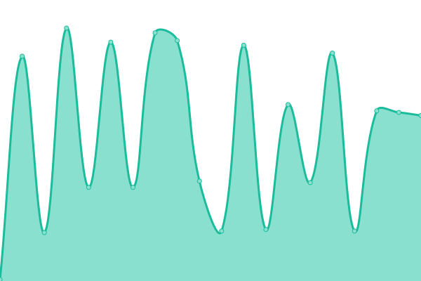 102ms
     
 | 

<a href="https://status.tgstation13.org/history/d-do-s-relay-us-w-hil-3">96.10%</a>
    

<!--end: status pages-->

[**Visit our status website →**](https://status.tgstation13.org)

## 📄 License

- Powered by: [Upptime](https://github.com/upptime/upptime)
- Code: [MIT](./LICENSE) © [Anand Chowdhary](https://anandchowdhary.com), supported by [Pabio](https://pabio.com)
- Data in the `./history` directory: [Open Database License](https://opendatacommons.org/licenses/odbl/1-0/)
